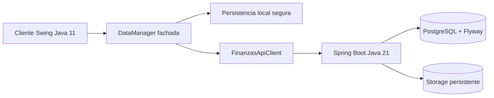

# Arquitectura

## Vista General

FinanzasApp mantiene dos modos explicitos:

- **Modo local**: cliente Java Swing con estado versionado en el directorio estable `~/.finanzasapp` o `FINANZAS_DATA_DIR`. No requiere backend.
- **Modo API**: cliente Swing conectado a `finanzas-backend`; el backend REST es la fuente de verdad para usuarios, preferencias, workspaces, categorias, transacciones, presupuestos, metas, recurrencias, hogar compartido, notificaciones, reportes, avatar y libro mayor de ahorro.

## Modulos Principales

- `src/main/java/com/finanzas/ui`: pantallas Swing.
- `src/main/java/com/finanzas/data`: fachada local, persistencia, exportacion y reglas de dominio heredadas.
- `src/main/java/com/finanzas/api`: cliente HTTP Java 11 para el backend.
- `finanzas-backend/src/main/java/com/finanzas/backend/api`: controladores REST.
- `finanzas-backend/src/main/java/com/finanzas/backend/service`: servicios de aplicacion.
- `finanzas-backend/src/main/java/com/finanzas/backend/domain`: entidades JPA y reglas de dominio backend.
- `finanzas-backend/src/main/resources/db/migration`: migraciones Flyway.

## Decisiones

- El POM agregador no se incorporo para no cambiar el empaquetado desktop actual. Ver ADR `docs/adr/0001-maven-wrapper-and-no-aggregator.md`.
- El ahorro automatico usa libro mayor inmutable y movimientos compensatorios. Ver ADR `docs/adr/0002-savings-ledger.md`.
- El avatar remoto usa clave portable y endpoint autenticado con cache HTTP. Ver ADR `docs/adr/0003-avatar-storage.md`.
- OpenAPI canonico vive en el backend y se sincroniza al cliente. Ver ADR `docs/adr/0004-openapi-canonical-source.md`.
- Las preferencias de usuario usan `user_settings` y tokens de tema propios para no introducir una dependencia Swing nueva en esta fase.

## Estado De Refactorizacion

`DataManager` sigue siendo una fachada grande por compatibilidad, pero ya delega al cliente HTTP y mantiene caches transitorias del backend. El siguiente paso arquitectonico es extraer servicios de cliente (`SessionService`, `WorkspaceService`, `ProfileService`, `SavingsClientService`, `SyncService`) sin cambiar la interfaz Swing de golpe.
