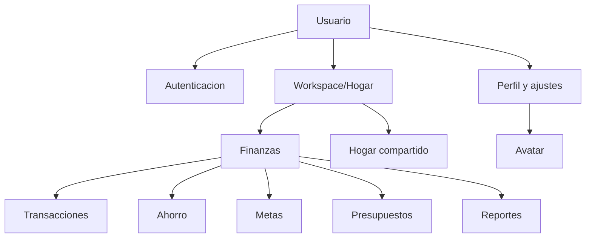

# Casos De Uso

## Actores Y Roles

- Usuario: opera finanzas personales.
- OWNER: administra workspace, miembros y reglas criticas.
- ADMIN: gestiona datos del workspace salvo transferencia de propiedad.
- MEMBER: registra y consulta datos permitidos.
- VIEWER: consulta datos, sin mutaciones financieras.
- Backend: fuente de verdad en modo API.
- Sistema local: fuente de verdad solo en modo local.

## Catalogo

Cada fila incluye: ID, nombre, actor principal/secundarios, objetivo, disparador, precondiciones, flujo principal, alternativos/excepciones, postcondiciones, reglas, permisos, datos, criterios y pruebas relacionadas.

| ID | Caso | Actor / secundarios | Objetivo y disparador | Precondiciones | Flujo principal | Alternativos y excepciones | Postcondiciones, reglas, permisos y datos | Criterios y pruebas |
|---|---|---|---|---|---|---|---|---|
| UC-001 | Registro | Usuario / Backend | Crear cuenta al enviar formulario | Email no registrado, password valida | 1. Capturar datos. 2. Normalizar email. 3. Crear usuario. 4. Crear workspace inicial. 5. Emitir tokens | Email duplicado 409; validacion 422 | Usuario, workspace, miembro OWNER, categorias por defecto; auditar registro | Login posterior funciona; pruebas auth existentes |
| UC-002 | Inicio de sesion | Usuario / Backend | Abrir sesion con credenciales | Usuario existe | 1. Validar rate limit. 2. Verificar password. 3. Emitir access/refresh. 4. Sincronizar snapshot | Credenciales 401; bloqueo 429 | Tokens no se persisten; refresh rotado; reset revoca refresh activos | `RefreshTokenServiceTest`, pruebas local login |
| UC-003 | Recuperacion de password y sesiones | Usuario / email sink | Recuperar acceso y controlar sesiones | Email verificable o sesion activa | 1. Solicitar recuperacion. 2. Emitir token hasheado. 3. Enviar correo a sink. 4. Cambiar password. 5. Revocar refresh tokens. 6. Listar/revocar sesiones desde ajustes | Token expirado/reusado; correo desconocido no enumera; sesion ajena 404 | Backend, LoginFrame y ConfiguracionPanel implementan solicitud/confirmacion/sesiones; SMTP pendiente | `AccountTokenServiceTest`, `RefreshTokenServiceTest`, `AuthApplicationServiceTest`, `FinanzasApiClientTest` |
| UC-004 | Perfil y avatar | Usuario / Backend | Actualizar perfil/avatar | Sesion activa | 1. Editar perfil. 2. Validar unicidad email. 3. Reiniciar verificacion si cambia email. 4. Subir avatar multipart. 5. Cliente cachea por ETag | Avatar corrupto 422; sin avatar 404; token verificacion expirado 410 | UserResponse no expone rutas fisicas; avatar aislado; ciudad/pais y `emailVerified` visibles | `AvatarStorageServiceTest`; perfil/settings en `DataManagerRegressionTest`, `UserSettingsServiceTest`, `FinanzasApiClientTest` |
| UC-005 | Crear workspace | Usuario / Backend | Crear espacio personal/hogar/negocio | Sesion activa | 1. Capturar nombre/tipo. 2. Crear workspace. 3. Asignar OWNER | Validacion 422 | Workspace y miembro owner | `FinanzasApiClientTest`; falta E2E visual |
| UC-006 | Seleccionar workspace | Usuario / Backend | Cambiar hogar activo | Lista de workspaces fresca | 1. Listar workspaces. 2. Elegir workspace. 3. Verificar membresia. 4. Sincronizar | Workspace removido 403/404 | Selector Swing persistido por usuario; fallback si pierde acceso | `FinanzasApiClientTest`; falta E2E visual |
| UC-007 | Gestion del hogar | OWNER/ADMIN / miembros | Administrar integrantes | Workspace hogar | 1. Ver miembros. 2. Invitar/remover/cambiar rol. 3. Transferir OWNER si aplica. 4. Abandonar workspace con regla segura. 5. Auditar | Sin permisos 403; OWNER compartido no puede salir sin transferir 409 | Backend soporta miembros; Swing lista/invita/remueve/cambia rol/transfiere/sale | `WorkspaceAccessServiceTest`, `WorkspaceCollaborationServiceTest`, `FinanzasApiClientTest`; falta UI E2E |
| UC-008 | Invitaciones | OWNER/ADMIN, invitado / Backend | Invitar, aceptar o rechazar | Email destino valido | 1. Crear invitacion. 2. Mostrar bandeja interna. 3. Aceptar/rechazar. 4. Refrescar workspaces | Expirada/cancelada 409/410 | Backend y Swing cubren bandeja recibida/enviada, aceptar/rechazar/cancelar | `FinanzasApiClientTest`, `WorkspaceCollaborationServiceTest`; falta E2E dos usuarios |
| UC-009 | Ingresos | MEMBER+ / Backend | Crear/editar/borrar ingreso | Categoria valida, workspace autorizado | 1. Registrar ingreso. 2. Crear ahorro automatico vigente. 3. Editar recalcula delta. 4. Borrar revierte | Validacion 422; IDOR 403/404 | Transaction + savings_movements inmutables | `SavingsServiceTest` SAV-001,003,004 |
| UC-010 | Gastos | MEMBER+ / Backend | Crear/editar/borrar gasto | Categoria valida | 1. Registrar gasto. 2. Recalcular presupuestos. 3. Sincronizar | Validacion 422 | No modifica ahorro salvo saldo disponible calculado | `SavingsServiceTest` SAV-002 |
| UC-011 | Configuracion de ahorro | OWNER/ADMIN | Definir porcentaje | Workspace autorizado | 1. Leer config. 2. Ajustar enabled/percentage. 3. Guardar version | Porcentaje invalido 422 | Config por workspace, modo PERCENTAGE | `SavingsServiceTest` cobertura indirecta |
| UC-012 | Ahorro automatico | Sistema / Transacciones | Separar ahorro desde ingresos | Config enabled | 1. Calcular porcentaje. 2. Redondear 2 decimales. 3. Crear movimiento CREDIT | Reintento idempotente | Libro mayor inmutable | `SavingsServiceTest` SAV-001,007 y redondeo |
| UC-013 | Deposito y retiro | Usuario / Backend | Depositar o retirar ahorro libre | Sesion y saldo suficiente | 1. Confirmar monto. 2. Crear movimiento. 3. Resumen actualizado | Retiro excesivo 409 | Retiro aumenta saldo no ahorrado | `SavingsServiceTest` SAV-005,006 |
| UC-014 | Metas | Usuario / Backend | Crear meta y asignar/liberar ahorro | Ahorro libre disponible | 1. Crear meta. 2. Asignar ahorro. 3. Liberar si aplica | Asignacion excedida 409 | Meta no crea dinero | `SavingsServiceTest` SAV-009 |
| UC-015 | Presupuestos | Usuario / Backend/local | Controlar gasto mensual | Categoria y mes | 1. Crear presupuesto. 2. Calcular gasto real. 3. Alertar umbrales | Categoria inexistente | Datos de presupuesto y transacciones | `DataManagerRegressionTest` |
| UC-016 | Categorias | Usuario / Backend/local | Buscar, crear, editar, archivar, restaurar | Workspace/perfil activo | 1. Filtrar por tipo/estado/q. 2. Elegir color. 3. Guardar. 4. Restaurar conserva UUID | Duplicado 409; color invalido 422 | Categoria referenciada no se elimina fisicamente | Pruebas cliente existentes; falta test API especifico |
| UC-017 | Compras/facturas | Usuario / Backend | Registrar soportes | Modulo no implementado | Pendiente | Adjuntos inseguros deben rechazarse | Pendiente de diseno/migracion | Pendiente |
| UC-018 | Gastos compartidos | MEMBER+ / miembros | Dividir gastos reales | Miembros UUID validos | 1. Elegir pagador con `MemberOption`. 2. Elegir participantes. 3. Calcular splits. 4. Guardar por UUID | Montos no cuadran 422; self payment bloqueado en liquidacion | Backend opera por UUID; UI backend usa etiquetas unicas con email para nombres duplicados | `SharedExpenseSplitCalculatorTest`, `SharedExpenseServiceTest`; falta E2E visual dos clientes |
| UC-019 | Liquidaciones | MEMBER+ / Backend | Reducir deuda pendiente | Deuda existente | 1. Elegir deudor/acreedor con UUID. 2. Validar monto. 3. Registrar settlement. 4. Recalcular balances. 5. Crear nuevo gasto con mismos miembros | Monto superior 409/422 | No desactiva miembros; historial se conserva | `SharedExpenseServiceTest`; falta E2E visual |
| UC-020 | Recurrencias | Usuario / Scheduler/API | Ejecutar movimientos periodicos | Recurrencia activa | 1. Crear recurrencia. 2. Ejecutar `/run`. 3. Avanzar fecha | Ejecucion duplicada debe evitarse | Backend soporta ejecucion manual; scheduler pendiente | `RecurringTransactionEntityTest` |
| UC-021 | Simulacion | Usuario / local | Probar escenarios sin tocar datos | Datos actuales | 1. Ingresar escenario. 2. Calcular proyeccion. 3. Mostrar resultado | Division por cero / entradas invalidas | No persiste cambios | `FinancialHealthAndSimulationTest`; alcance pedido parcial |
| UC-022 | Calculadora | Usuario / local | Calcular y usar resultado | Campo activo | Pendiente | Expresion invalida | No implementada completa | Pendiente |
| UC-023 | Reportes | Usuario / Backend/local | Exportar resumen | Rango valido | 1. Consultar summary. 2. Exportar CSV/PDF/XLSX. 3. Auditar | Formato no soportado | Backend expone formatos; generadores minimos | Pruebas unitarias existentes parciales |
| UC-024 | Preparacion DIAN | Usuario / fuentes oficiales | Preparar informacion tributaria | Anio fiscal | Pendiente | No afirmar certificacion | No implementado | Pendiente |
| UC-025 | Ajustes, tema y moneda | Usuario / Backend/local | Persistir preferencias | Perfil activo | 1. Elegir moneda/locale/zona/formato/tema. 2. Guardar local o backend. 3. Aplicar tema. 4. Sincronizar settings al iniciar sesion | Preferencia invalida 422 | `user_settings` conectado; formato monetario aun no se aplica en todos los paneles | `UserSettingsServiceTest`, `DataManagerRegressionTest`, `FinanzasApiClientTest` |
| UC-026 | Backup/restauracion | Usuario / local/Postgres | Proteger datos | Ruta destino valida | 1. Crear respaldo. 2. Validar ZIP. 3. Restaurar con limites | ZIP slip/bomb rechazado | Estado original no se sobrescribe durante migracion legacy | `DataManagerRegressionTest`; falta pruebas maliciosas completas |
| UC-027 | Migracion local a backend | Usuario / Backend | Importar datos legacy | Sesion backend y respaldo | Pendiente: dry-run, resumen, claves de importacion | Error por registro no debe abortar todo | No implementado completo | Pendiente |
| UC-028 | Sincronizacion | Cliente / Backend | Ver cambios entre equipos | Backend disponible | 1. Refrescar snapshot. 2. Cachear. 3. Mostrar errores | 401 renueva token; 409 version debe recargar | Refresh 401 implementado; incremental continuo pendiente | Cliente compila; falta MockWebServer/E2E |
| UC-029 | Exportar o eliminar cuenta | Usuario / Backend | Descargar datos propios o borrar cuenta | Sesion backend activa | 1. Exportar JSON de perfil/preferencias/sesiones/workspaces. 2. Confirmar email/password. 3. Revocar sesiones. 4. Borrar avatar/preferencias. 5. Anonimizar cuenta | Confirmacion invalida 422; password invalida 401; owner de workspace compartido 409 | Email queda liberado, auditoria conserva referencia anonima y UI vuelve al login | `UserAccountServiceTest`, `FinanzasApiClientTest` |
